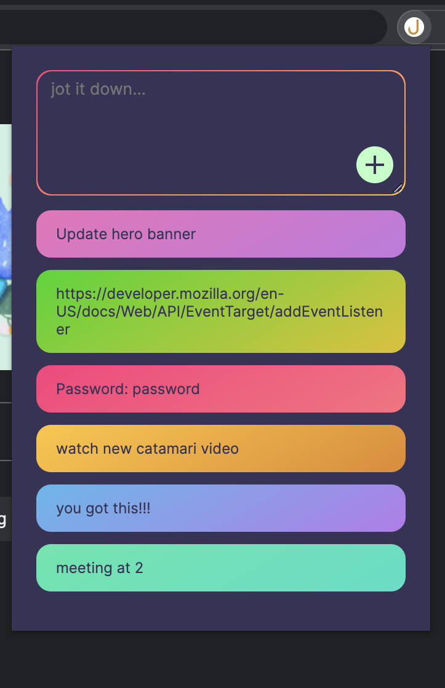
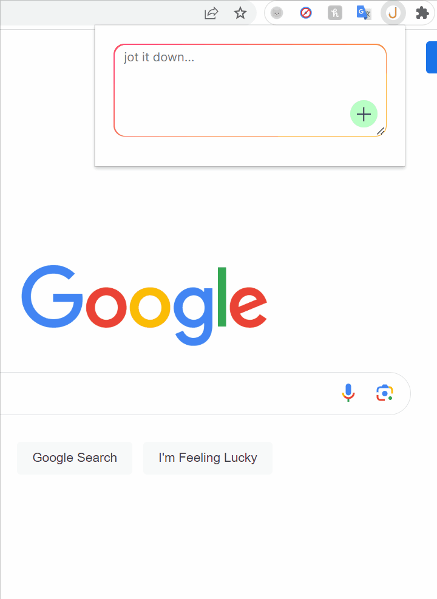

# jot

### A notes app that doesn't take itself too seriously.
A neat little chrome extension to jot down some quick notes.

## Walkthrough:

## Features:
- Save notes quickly
- Easily delete notes with a simple double click
- Uses localStorage for persistence
- Comes in fun colors to brighten up your day
- Dark and light themes

## Built with:
- HTML
- CSS
- JavaScript
- Chrome API
